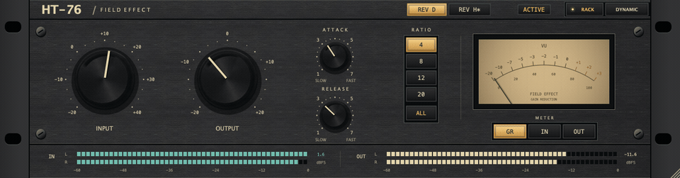
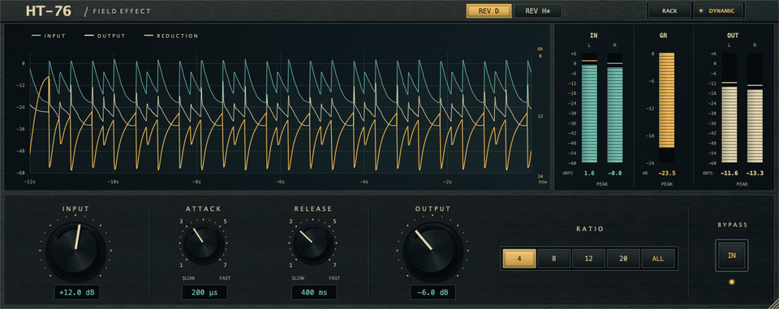
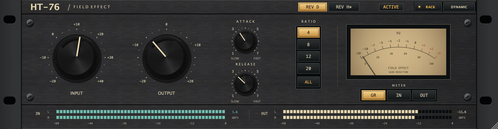
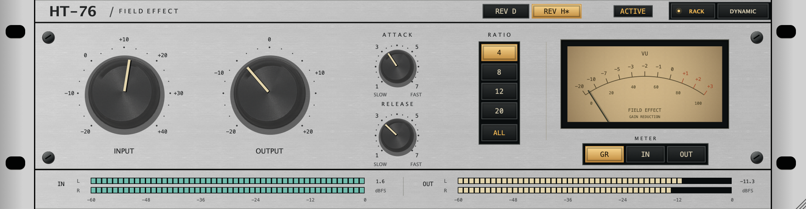
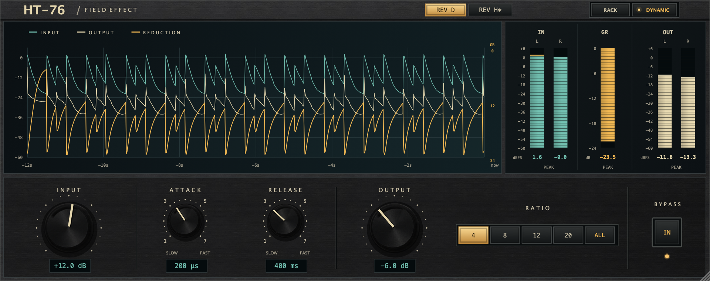
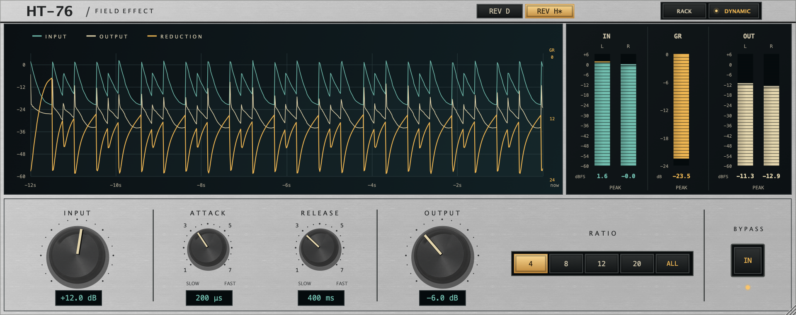

[](README.md)[](README.en.md)

# HT-76




**A JUCE-based, 1176-style FET compressor combining a classic rack panel with a modern, real-time dynamics display.**

Choose between two classic 1176-inspired DSP models: Rev D with a black panel and Rev H with a silver panel. Rev H is experimental and has not been calibrated against physical hardware.

## Download and installation

[](https://github.com/Hikari-Tsai/HT-76/releases) &emsp;&emsp;
[](docs/INSTALLATION.en.md) &emsp;&emsp;
[](https://github.com/Hikari-Tsai/HT-76/issues)

1. **Download:** Expand **Assets** on the Releases page and choose the installer for your platform below. Releases marked Pre-release are test versions; Source code archives contain source files.
2. **Install:** Close your DAW, run the installer, and select the formats you need. All formats are selected by default; deselect any you do not need.
3. **Load:** Reopen your DAW, scan for plug-ins, and search for **HT-76** under audio effects (manufacturer: **Field Effect**). Use AU in Logic Pro, or VST3 in a DAW that supports it.

| Platform | Download and install | Formats |
| --- | --- | --- |
| macOS 12+ · Universal for Intel and Apple Silicon | Open `*-macos-universal-Installer.dmg`, then run `Install HT-76.pkg` | AU, VST3, AAX |
| Windows x64 | Run `*-windows-x64-Setup.exe`; includes the Visual C++ runtime | VST3, AAX |

**These are test builds without production signing.** If your system blocks installation, see [troubleshooting](docs/INSTALLATION.en.md#troubleshooting). AAX is not signed by Avid/PACE and is intended only for Pro Tools Developer testing; retail Pro Tools cannot load it. Most users can deselect AAX.

**Uninstall:** On macOS, run `Uninstall HT-76.command` from the DMG and enter `UNINSTALL` when prompted. On Windows, uninstall **HT-76 Plugins** from Settings → Apps. Close your DAW first.

See the [full installation guide](docs/INSTALLATION.en.md) for manual ZIP installation, plug-in locations, and DAW scanning instructions.

## Interface preview

### Classic Rack

Rev D uses a charcoal brushed-metal panel. Switching to Rev H changes it to neutral silver with dark labels. The large Input/Output knobs, analog-style VU meter, and rectangular Ratio/Meter buttons retain the same layout. The lower stereo IN/OUT PPM panel also switches between black and silver, with matching label and scale contrast; the LED strips keep their dark recessed backgrounds. Knob focus outlines follow the knob edges.

**Rev D · Black panel**



**Rev H · Silver panel and PPM section**



### Dynamic View

Approximately 12 seconds of Input, Output, and Gain Reduction history show changes in dynamics. Stereo level and gain reduction meters sit on the right, with controls below. The metal panel follows the selected revision, while the graph and meters keep their dark backgrounds.

**Rev D · Black panel**



**Rev H · Silver panel**



These screenshots show the native JUCE Editor with offline test audio running through the actual DSP.

## Features and controls

- Mono and stereo processing. Stereo channels share detection and compression control to preserve their relative gain.
- 4:1, 8:1, 12:1, and 20:1 ratios, plus a separate ALL mode.
- Instant Rack/Dynamic switching, proportional UI resizing, and saved view/window size.
- IN/OUT peak, RMS, peak hold, and core gain reduction metering; the Rack VU switches between GR, IN, and OUT.
- DAW parameter automation, project state recall, and host bypass.
- Knob dragging, Shift for fine adjustment, mouse wheel, arrow keys, and double-click reset.

| Control | Range / options | Purpose |
| --- | --- | --- |
| Input | −20 to +40 dB | Adjusts the level driving the FET core, affecting compression and nonlinear response |
| Output | −20 to +20 dB | Adjusts output-stage gain before the modeled transformer, also affecting how hard it is driven |
| Attack | 20–800 µs | Faster clockwise |
| Release | 50–1100 ms | Faster clockwise |
| Ratio | 4:1 / 8:1 / 12:1 / 20:1 | Selects the compression ratio |
| ALL | On / off | Enables the upstream model's all-buttons mode; the previous Ratio is retained when leaving ALL |
| Bypass | On / off | Switches to the latency-compensated dry signal |
| Circuit revision | Rev D / Rev H (experimental) | Switches input/output-stage models with a 20 ms crossfade |

Set Input for the amount of compression you want, then use Output to match the level when comparing against bypass. Attack and Release control the response to transients and the subsequent gain recovery. There is no separate Threshold knob.

When processing is enabled, IN measures the signal after Input gain; in bypass it measures the dry signal. OUT measures the actual output. GR measures attenuation in the core gain cell, rather than estimating it from the difference between IN and OUT.

## Algorithm sources

| Model and documentation | Panel | Main characteristics |
| --- | --- | --- |
| [Rev D model documentation (Traditional Chinese)](docs/REV_D_MODEL.md) | Black brushed metal | Rev D-oriented FET core from fetcomp-dsp, Class A output stage, and transformer magnetics approximation |
| [Rev H model documentation (experimental)](docs/REV_H_MODEL.md) | Silver brushed metal | Retains the FET sidechain; adds an electronic input, push-pull output, and separate transformer model; not calibrated against hardware |

### FET compression core: fetcomp-dsp

| Item | Source |
| --- | --- |
| Upstream project | [Paulllux/fetcomp-dsp](https://github.com/Paulllux/fetcomp-dsp) |
| Original author | Paul Ulrix |
| Integrated revision | [`de18f5ac793e36397c725abdca7fcb8c08760ce2`](https://github.com/Paulllux/fetcomp-dsp/tree/de18f5ac793e36397c725abdca7fcb8c08760ce2) |
| Local core files | [FetLimiterDsp.h](third_party/fetcomp-dsp/FetLimiterDsp.h), [MathUtils.h](third_party/fetcomp-dsp/MathUtils.h) |
| Upstream license | [MIT License](third_party/fetcomp-dsp/LICENSE) |

This project directly integrates upstream code with local modifications. Credit for the original FET circuit model implementation belongs to the author above.

According to the upstream documentation, the model references the UREI 1176LN Rev D R-10743 schematic and includes:

- **JFET gain cell:** A series resistor and shunt JFET form a nonlinear voltage divider, with a quadratic equation solved per sample to model compression and distortion.
- **Feedback sidechain:** The signal is sampled after the gain cell, then rectified and processed by envelope/control circuitry to influence the gain of subsequent samples.
- **Attack/Release and Ratio networks:** Model compression onset and recovery, including ALL mode.
- **Output-stage character:** A Class A amplifier stage and a Jiles–Atherton-style transformer magnetics model.

The model uses component and numerical integration approximations. Upstream describes calibration against a reference plug-in; this project has not performed measurements against a physical 1176. See the preserved [upstream README](third_party/fetcomp-dsp/README.md) for topology, approximations, and limitations.

### Mathematical approximations: Chowdhury DSP

Upstream `MathUtils.h` credits **Jatin Chowdhury / [chowdsp_utils](https://github.com/Chowdhury-DSP/chowdsp_utils)** for some trigonometric and hyperbolic approximations, either taken from or reimplemented from its mathematical code.

These are used through `fetcomp-dsp`; this project does not directly link the full `chowdsp_utils` library. The relevant module is marked BSD 3-Clause. Attribution is preserved in [chowdsp-math-module.txt](third_party/licenses/chowdsp-math-module.txt).

### Experimental Rev H model

The `REV D` / `REV H*` switch changes the actual DSP path. Rev H adds a behavioral model of an electronically balanced input, a symmetrical push-pull amplifier with negative feedback, and a separate saturable output transformer. The implementation is in [RevHStages.h](Source/RevHStages.h), under Apache 2.0.

**This is an approximation based on the G/H circuit architecture, without calibration against a physical Rev H.** The FET gain cell, Attack/Release, Ratio, and ALL behavior retain the existing fetcomp-dsp core. Levels, bandwidth, saturation, and feedback coefficients in the added stages are current engineering assumptions, not a claim of component-by-component or complete hardware reproduction. See the [Rev H model documentation](docs/REV_H_MODEL.md) for sources, equations, coefficients, and outstanding validation.

Both models run continuously to preserve their histories, increasing CPU usage. IN references the signal after digital Input gain; OUT measures the actual output. During a revision crossfade, GR blends the readings of both cores. Rev D retains its existing signal path and parameter identifiers; the new revision selector supports DAW automation and state recall.

### Integration and local changes

While preserving the main upstream circuit equations and stereo linking, this project adds:

- **Real-time memory management:** Work buffers are allocated during preparation to avoid allocation on the first audio callback or a block-size change. Larger blocks are processed in chunks.
- **Accurate GR metering:** Per-sample gain-cell attenuation is exposed, retaining the peak reduction within each block for the VU and history display.
- **Gain and bypass smoothing:** Rev D applies Input gain once in the wrapper; Rev H applies it after the electronic input stage. Both use 20 ms smoothing. Bypass uses a 5 ms crossfade and compensates for oversampling latency.
- **Oversampling:** 2× IIR oversampling below 88.2 kHz, and native-rate processing at 88.2 kHz and above, with actual latency reported to the DAW.
- **Metering and state integration:** A fixed-capacity SPSC queue transfers meter data at approximately 60 Hz, with corrected gain-smoother reset state and handling of non-finite values.

See [LOCAL_CHANGES.md](third_party/fetcomp-dsp/LOCAL_CHANGES.md) for the full change record and [Source/DspEngine.cpp](Source/DspEngine.cpp) for the integration.

## Building from source

Requires **CMake 3.22+, Git, and a C++17 compiler**. Use Xcode / Command Line Tools on macOS, or Visual Studio 2022 with Desktop development with C++ on Windows.

JUCE is pinned to **8.0.12**, commit [`29396c22c93392d6738e021b83196283d6e4d850`](https://github.com/juce-framework/JUCE/tree/29396c22c93392d6738e021b83196283d6e4d850), including AAX SDK 2.9.0. If `third_party/JUCE` is absent, CMake fetches that version; the first build needs network access.

### macOS

```sh
cmake -S . -B build -DCMAKE_BUILD_TYPE=Release '-DCMAKE_OSX_ARCHITECTURES=arm64;x86_64'
cmake --build build --config Release --parallel 4
ctest --test-dir build -C Release --output-on-failure
```

Release builds are Universal, containing both architectures. For local development, you can select only `arm64` or `x86_64`. Run tests on a system capable of executing the target architecture.

On Apple Silicon, you can also run `./scripts/build-macos.sh`. After building, `./scripts/install-macos.sh` installs AU/VST3 and backs up existing plug-ins with the same name. That installation script does not include AAX.

### Windows

Run in Visual Studio 2022 Developer PowerShell:

```powershell
cmake -S . -B build -G "Visual Studio 17 2022" -A x64
cmake --build build --config Release --target FieldEffect_VST3 FieldEffect_AAX FieldEffectTests --parallel 2
ctest --test-dir build -C Release --output-on-failure
```

Plug-ins are built under `build/FieldEffect_artefacts/Release/<format>/`. CMake targets are `FieldEffect_AU`, `FieldEffect_VST3`, and `FieldEffect_AAX`; the standalone target is `FieldEffect_Standalone`.

### Projucer / Xcode

Open [HT-76.jucer](HT-76.jucer) with Projucer 8.0.12 to match the modules. If you do not have a local JUCE checkout, prepare the pinned version:

```sh
git clone --branch 8.0.12 --depth 1 https://github.com/juce-framework/JUCE.git third_party/JUCE
./scripts/open-projucer.sh
```

If `third_party/JUCE` already exists, run the launcher script directly. It builds the matching Projucer if needed. Save your work and quit any other running Projucer version first.

In Projucer, select **Xcode (macOS) → Save and Open in IDE**, then choose the AU, VST3, AAX, or Standalone Plugin target. The exported project is `Builds/MacOSX/HT-76.xcodeproj`.

## GitHub Actions and releases

[build-plugins.yml](.github/workflows/build-plugins.yml) runs on pushes, pull requests, and manual dispatch. Windows x64 and macOS Universal jobs compile, test, verify architectures, and package the plug-ins. The Universal artifacts also go to an Intel runner for the same test executable and installation/uninstallation checks. Successful runs produce **five plug-in ZIPs, one Universal macOS DMG, and one Windows EXE**, plus CI logs.

**Pushing a tag that starts with `v` automatically publishes a GitHub Release with that tag after all builds and Intel verification succeed.**

New release notes include macOS Gatekeeper, signing and notarization status, Windows SmartScreen / unknown publisher messages, and the restriction preventing unsigned AAX from loading in retail Pro Tools, with official platform documentation links.

```sh
git tag -a v0.93 -m "HT-76 v0.93 pre-release"
git push origin v0.93
```

`v0.93` corresponds to plug-in version `0.9.3`. It is marked **Pre-release**, not Latest. It is published only after every platform completes its build, tests, and packaging.

CI verifies the five ZIPs, one DMG, one EXE, and their SHA-256 checksums. Only those seven installation/download files are uploaded to the Release. It starts as a draft and is published after all uploads finish. Reruns reuse the same release and update matching assets; published assets cannot be overwritten when immutable releases are enabled. Regular branches, pull requests, manual runs, and tags without a `v` prefix produce Actions artifacts only.

The product version comes from `CMakeLists.txt`; **a tag does not change the plug-in version automatically**. Update both CMake and Projucer versions before releasing. ZIP/DMG/EXE filenames include product version, commit, platform, architecture, and format. Actions plug-in artifacts are retained for 30 days and logs for 14 days; Release attachments are not subject to those retention periods.

The workflow uses GitHub's automatic token; only the release job gets `contents: write`. No separate PAT is needed. Commit `.github/`, source, tests, scripts, `design/assets/`, `docs/images/`, and the bundled DSP source. CI fetches JUCE, so its checkout does not need to be committed.

Use the same packaging scripts locally:

```sh
python3 scripts/package-plugins.py --build-dir build --platform macos --arch universal --formats AU VST3 AAX --output-dir dist
python3 scripts/package-dmg.py --arch universal --archive-dir dist --output-dir dist
python3 scripts/verify-dmg.py dist/HT-76-0.9.3-local-macos-universal-Installer.dmg
```

The DMG tools use macOS `pkgbuild`, `productbuild`, and `hdiutil`. First create AU/VST3/AAX ZIPs with the same version, architecture, and source revision. By default, `verify-dmg.py` only mounts, expands, and inspects the package; adjust the example filename to match your artifact. On fresh GitHub-hosted Apple Silicon and Intel runners, macOS CI installs all three formats from the same Universal DMG, checks both architectures and package receipts, then tests uninstallation and repeated execution.

The Windows installer uses **Inno Setup 6.3+** (the GitHub `windows-2022` runner has Inno Setup 6 installed). After installing Inno Setup 6 and Visual Studio 2022 C++ tools locally, run:

```powershell
python scripts/package-plugins.py --build-dir build --platform windows --arch x64 --formats VST3 AAX --output-dir dist
python scripts/package-windows.py --archive-dir dist --output-dir dist
```

For tools outside their default locations, pass `--iscc <path to ISCC.exe>` and `--vc-redist <path to vc_redist.x64.exe>`. Windows CI tests the default all-formats installation, reinstallation, VST3-only installation, uninstallation, and preservation of user files on a fresh GitHub-hosted runner. Tests that modify system installation directories are restricted to GitHub-hosted runners.

## Tests and current validation scope

Tests cover mono/stereo processing, 44.1–192 kHz sample rates, different block sizes, parameter/state recall, bypass latency, GR/peak/RMS metering, non-finite values, and the native Editor. There are also macOS audio-callback allocation checks and packaging validation tests.

```sh
ctest --test-dir build -C Release --output-on-failure
python3 -m unittest discover -s Tests -p 'test_package*.py' -v
```

The original separate-architecture [GitHub Actions run for v0.91](https://github.com/Hikari-Tsai/HT-76/actions/runs/35358874019) passed builds, audio/UI tests, packaging, installation, and uninstallation checks on Windows x64 and macOS Intel/ARM. The Universal workflow requires both Mach-O architectures in every plug-in and runs the same test artifact on Apple Silicon and Intel runners. AAX loading and playback have not been verified inside Pro Tools. These checks do not establish compatibility with every DAW, long-duration stability, or sonic equivalence to physical hardware.

## Project structure

| Path | Contents |
| --- | --- |
| [Source/PluginProcessor.cpp](Source/PluginProcessor.cpp) | JUCE host interface, automation, state, and bypass |
| [Source/DspEngine.cpp](Source/DspEngine.cpp) | FET core integration, smoothing, oversampling latency, and metering |
| [Source/PluginEditor.cpp](Source/PluginEditor.cpp) | Native Rack/Dynamic JUCE interface |
| [Source/MeterBridge.h](Source/MeterBridge.h) | Fixed-capacity metering queue from the audio thread to the UI |
| [third_party/fetcomp-dsp/](third_party/fetcomp-dsp/) | Upstream DSP, MIT license, and local change record |
| [Tests/](Tests/) | Audio, state, Editor, and packaging tests |
| [scripts/](scripts/) | Build, installation, Projucer launcher, and cross-platform packaging |
| [design/assets/](design/assets/) | Knobs and textures used by the native panel |
| [.github/workflows/](.github/workflows/) | Build and tagged-release automation |

## Credits and licensing

Thanks to **Paul Ulrix** for the FET compression model, **Jatin Chowdhury / Chowdhury DSP** for mathematical approximation code, and **JUCE** and **Avid** for the plug-in framework and SDKs.

HT-76's original code, documentation, and project assets are licensed under **Apache License 2.0**. See [LICENSE](LICENSE) for the full terms and [NOTICE](NOTICE) for attribution.

Third-party components retain their own licenses: MIT for `fetcomp-dsp`, BSD 3-Clause for the ChowDSP math module, AGPLv3 / commercial dual licensing for JUCE, and the supplied SDK terms for AAX. Apache 2.0 applies only to this project's original work; it does not replace the requirements of these dependencies or resulting derivative products.

See [third_party/DEPENDENCIES.md](third_party/DEPENDENCIES.md) for dependency versions and sources, and retain the original author and license notices.
